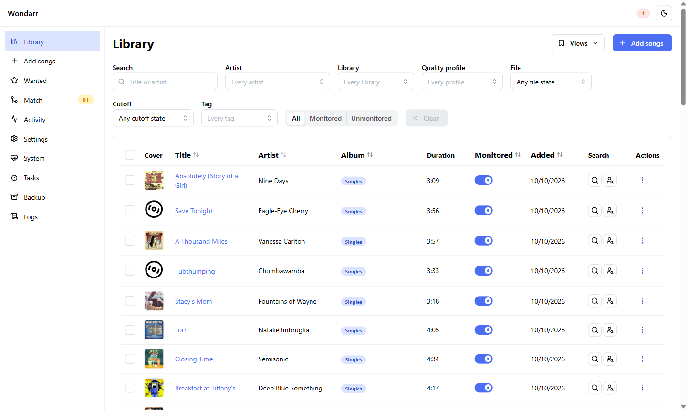
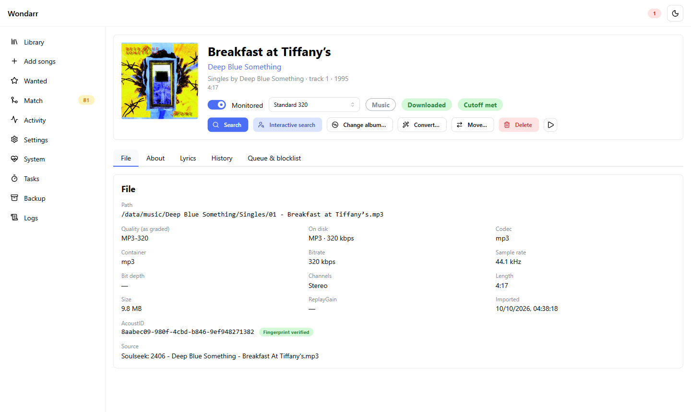
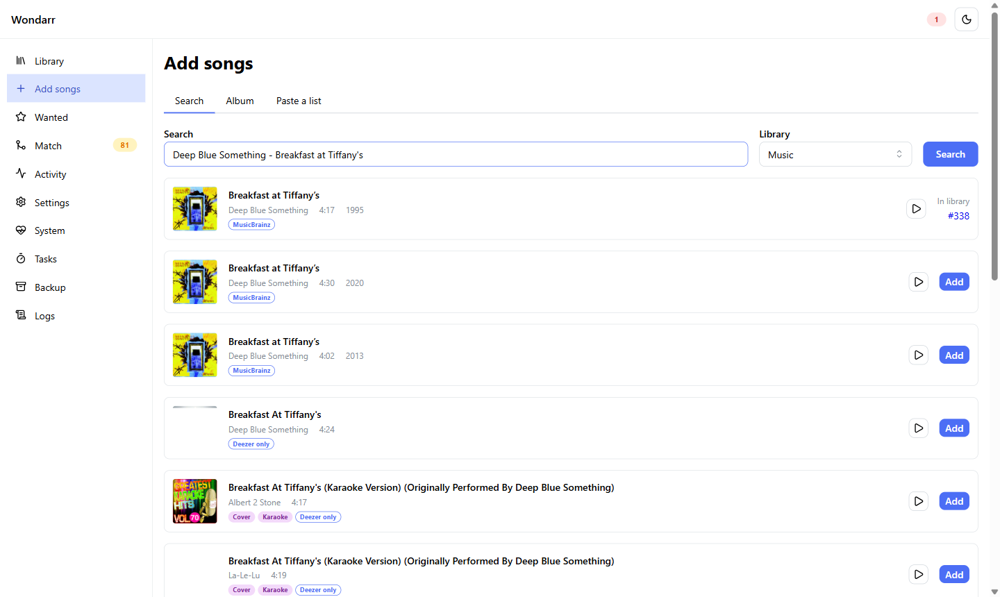
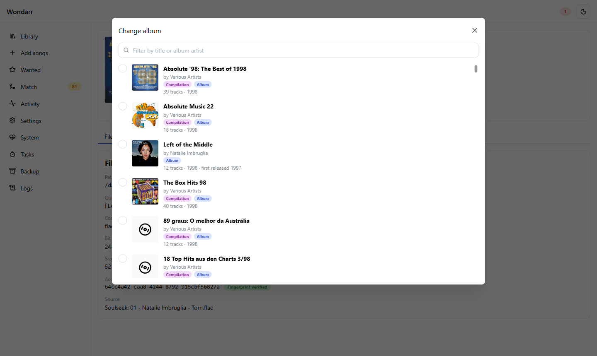
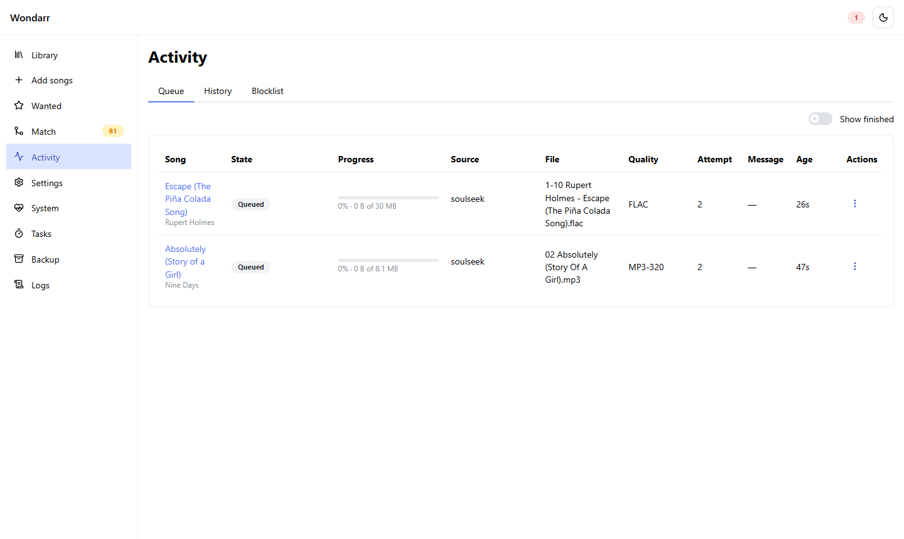

# Wondarr

**The \*arr for one-hit wonders.**

For those who like *Piña Coladas*, *Story of a Girl* and *Breakfast at Tiffany's*, but don't need the back-catalogue.

You know the feeling. You want *that* song — the one everybody knows — and Lidarr hands you the artist's entire discography, three live albums and a Christmas EP to get it. Wondarr is a self-hosted \*arr that thinks in **songs, not albums**. Tell it which songs you want; it goes and gets them, checks they're really the right recording, tags them properly, files them neatly into your library, and keeps an eye out for a better copy until it's happy with the quality.

If you've used Sonarr or Radarr, you already know how to drive it.



## What it does

- **Finds songs where they actually are.** Soulseek first (slskd is bundled, nothing to set up), then YouTube Music, then torrents and usenet via qBittorrent, SABnzbd and your indexers or Prowlarr.
- **Makes sure it's the right song.** Every download is checked by length and an AcoustID fingerprint, so you don't end up with a karaoke version, a live bootleg or a "Story of a Girl (Sped Up)". Fake FLACs made from MP3s get spotted and binned.
- **Upgrades quietly.** Set a quality profile ("320 kbps is fine" or "FLAC or bust") and Wondarr keeps looking until it gets there.
- **Keeps your library tidy.** Flat, per artist, artist/album, or a **Plexamp** layout that keeps albums together so Plex doesn't split them. Songs on compilations get a sensible home ("fewest albums" policy), and you can move one to another album whenever you like.
- **Knows what you already own.** Point it at your existing music as a *reference library*: it works out what's in there and never downloads it again (and never touches those files).
- **Takes requests in bulk.** Paste a list of `Artist - Title` lines, add a whole album's tracklist, or sync a Deezer / YouTube Music playlist, a Spotify CSV export, Last.fm or ListenBrainz loves.
- **Talks to Plex.** New songs show up in Plex straight away, and playlists can be kept in sync.
- **Has a page for every song.** The file, where it came from, the albums it appears on, BPM, lyrics, history, and (with a free Last.fm key) listener counts, tags and similar songs.



## Get it running

Docker is the way. One container, everything bundled (slskd, ffmpeg, fpcalc, yt-dlp), `linux/amd64` and `linux/arm64`:

```yaml
services:
  wondarr:
    image: ghcr.io/wulfftech/wondarr:0.1.0-rc.1   # :latest once 0.1.0 is final
    container_name: wondarr
    environment:
      - PUID=1000
      - PGID=1000
      - UMASK=002
      - TZ=Etc/UTC
    volumes:
      - ./config:/config
      - /srv/data:/data          # your music and the downloads, on one mount
    ports:
      - "1077:1077"              # the web UI
      - "50300:50300"            # Soulseek; forward this on your router for better results
    restart: unless-stopped
```

```bash
docker compose up -d
```

Unraid? There's a template — see [the Unraid guide](https://wulfftech.github.io/wondarr/getting-started/unraid/).

## Your first ten minutes

1. **Open `http://<your-host>:1077`** and set a login: go to `/login` once from your own network and it asks you to create one (change it later under Settings → General). On your home network Wondarr lets you straight in anyway.
2. **Soulseek:** Settings → Soulseek, put in a Soulseek username and password. Make a fresh account just for Wondarr — Soulseek only allows one login per account.
3. **Your library:** Settings → Library. There's a library called *Music* at `/data/music` already; point it wherever your music should live and pick a layout (Plexamp is a good default).
4. **Already have music?** Settings → Reference libraries → add your existing folder. Wondarr reads it, works out what you've got, and won't fetch any of it again.
5. **Plex (optional):** Settings → Plex, sign in, and link each library to its Plex music section.
6. **Add some songs:** *Add songs* → type `Deep Blue Something - Breakfast at Tiffany's` → **Add**. Or paste a whole list. Then watch **Activity**.



Optional extras, all under Settings: **YouTube** (off until you turn it on), **Download clients** and **Indexers** for torrents/usenet, an **AcoustID** key for fingerprint checks and a **Last.fm** key for the fun facts on song pages (Settings → General → Metadata services).

The full manual — install, every setting, Plex, qBittorrent, SABnzbd, troubleshooting — lives at **https://wulfftech.github.io/wondarr/**.

## A few more pictures

| Picking the right album for a song | Keeping track of downloads |
|---|---|
|  |  |

## Status

Every part of the plan is built and it's in daily use. The release candidate **0.1.0-rc.1** is out ([release notes](https://github.com/wulfftech/wondarr/releases/tag/v0.1.0-rc.1)); `:latest` follows once 0.1.0 is final. Found a bug or want something? [Open an issue](https://github.com/wulfftech/wondarr/issues).

## Under the hood

C# / .NET 10 (ASP.NET Core, EF Core + SQLite) and a React 19 + Mantine front end — the same family as the other \*arrs, so their GPL-3.0 parts could be ported. Port **1077** for the UI and the Lidarr-style API (`/api/v1`, `X-Api-Key`), so tools like Prowlarr, autobrr and Homepage plug in the way you'd expect.

<details>
<summary>For contributors and the curious: where everything is documented</summary>

| Read this | For |
|---|---|
| [The docs site](https://wulfftech.github.io/wondarr/) ([`website/`](website/)) | Installing and using Wondarr |
| [`CONTRIBUTING.md`](CONTRIBUTING.md) | Prerequisites, build/test commands, repository map and contribution rules |
| [`CHANGELOG.md`](CHANGELOG.md) | What changed in each release |
| [`NOTICE.md`](NOTICE.md) | Ported-code attributions and the third-party programs bundled in the image |
| [`AGENTS.md`](AGENTS.md) | Instructions for AI coding sessions: the build workflow, rules, commands |
| [`docs/HANDOVER.md`](docs/HANDOVER.md) | Where things stand and how to start the next session |
| [`docs/DECISIONS.md`](docs/DECISIONS.md) · [`docs/adr/`](docs/adr/) | Every decision taken with the owner, and the architectural ones as ADRs |
| [`docs/product/PRODUCT.md`](docs/product/PRODUCT.md) · [`GOALS.md`](docs/product/GOALS.md) · [`RISKS.md`](docs/product/RISKS.md) | What we are building, what we are not, and the risk register |
| [`docs/architecture/`](docs/architecture/) | Architecture, the matching engine, library output, stack, deployment, quality definitions |
| [`docs/build/`](docs/build/) | Phases, progress, the agent workflow, coding standards, repository layout |
| [`docs/research/FINDINGS.md`](docs/research/FINDINGS.md) | The URL-cited research behind every decision |
| [`docs/PLAN.md`](docs/PLAN.md) | The original planning document, frozen |

</details>

## Licence

GPL-3.0 (see [`LICENSE`](LICENSE)). slskd is redistributed unmodified under its own AGPL-3.0 licence and additional terms. See [`NOTICE.md`](NOTICE.md) for the full attribution list.
